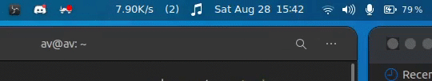

# intruder_alert
Want to know when someone connects to your network, from your family or a intruder?
Get a notification everytime this happens.

It keeps track of the devices being connected to your wifi router, If someone from you family connects it gives you a urgency(1) notification, if a stranger connects it gives you an urgency(2) alert notification.
